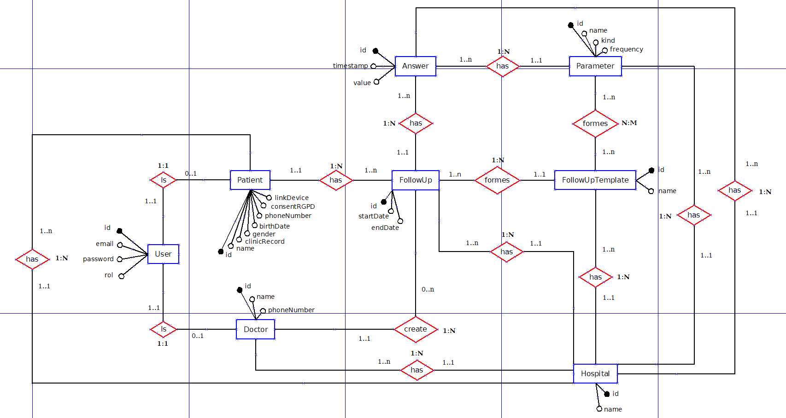
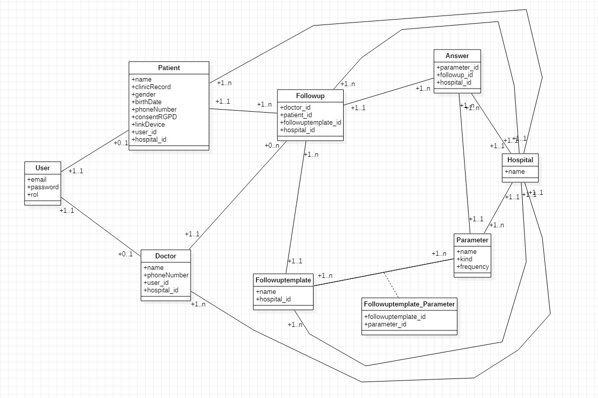
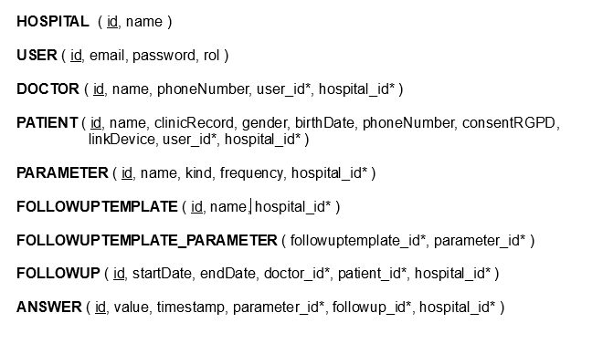
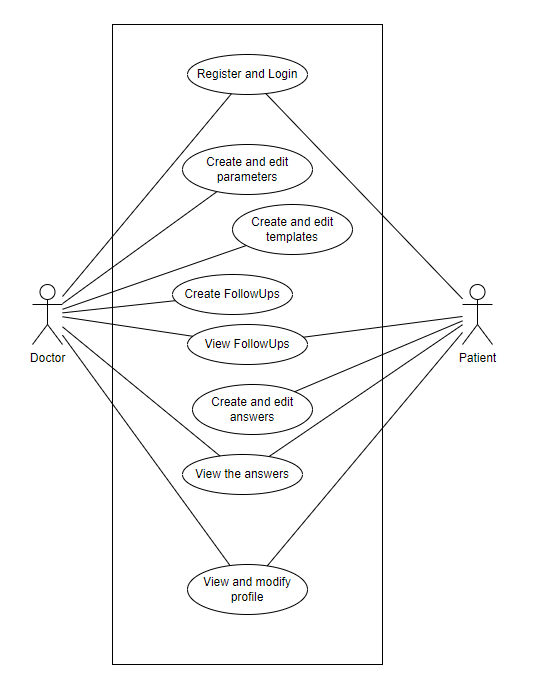

 

  <h3 align="center">Application for goal tracking for cardiology patients</h3>

  

    
    
    
  

   

  
Index

  <ol>
    <li>
      <a href="#cardiology-web-app">Cardiology Web App</a>
      <ul>
        <li><a href="#need-source">Need Source</a></li>
        <li><a href="#demanding-company">Demanding Company</a></li>
        <li><a href="#summarized-idea">Summarized Idea</a></li>
      </ul>
    </li>
    <li>
      <a href="#data-model">Data Model</a>
      <ul>
        <li><a href="#entities">Entities</a></li>
        <li><a href="#relationships">Relationships</a></li>
      </ul>
    </li>
    <li>
      <a href="#user-requirements">User Requirements</a>
      <ul>
        <li><a href="#user-cases">User Cases</a></li>
      </ul>
    </li>
    <li>
      <a href="#system-functioning-and-requirements">System requirements and functioning</a>
    </li>
    <li>
      <a href="#interfaces">Interfaces</a>
      <ul>
        <li><a href="#usability">Usability</a></li>
        <ul>
          <li><a href="#visual-design">Visual design</a></li>
          <li><a href="#error-handling">Error handling</a></li>
          <li><a href="#notifications-for-the-user">Notifications for the user</a></li>
          <li><a href="#font">Font</a></li>
          <li><a href="#user-customization">User customization</a></li>
          <li><a href="#interfaces-display">Interfaces display</a></li>
          <li><a href="#text-redaction">Text redaction</a></li>
          <li><a href="#multimedia-aspect">Multimedia aspect</a></li>
          <li><a href="#summary">Summary</a></li>
        </ul>
      </ul>
    </li>
    <li>
      <a href="#guides">Guides</a>
      <ul>
        <li><a href="#installation-guide">Installation guide</a></li>
        <ul>
          <li><a href="#first-of-all">First of all</a></li>
          <li><a href="#backend">Backend</a></li>
          <li><a href="#frontend">Frontend</a></li>
          <li><a href="#starting-the-app">Starting the app</a></li>
        </ul>
        <li><a href="#use-guide">Use guide</a></li>
      </ul>
    </li>
    <li>
      <a href="#technologies-comparison">Technologies comparison</a>
      <ul>
        <li><a href="#react">React</a></li>
        <li><a href="#ruby-on-rails">Ruby on Rails</a></li>
        <li><a href="#postgresql">PostgreSQL</a></li>
      </ul>
    </li>
    <li>
      <a href="#work-planning">Work Planning<a>
    </li>
    <li>
      <a href="#conclusion-and-opinion">Conclusion and opinion</a>
    </li>
    <li>
      <a href="#repositories-and-links-used">Repositories and links used</a>
    </li>
  </ol>

# Cardiology Web App
Welcome to the -*Cardiology patients' goal tracking app*-, an application created to make the medical process of creating and sending follow-ups easier. 
This app can be used by either doctors and patients. The firts ones can create parameters and templates that will later be used to create follow-ups for the patients. 
The patients then can check their follow-ups and fill the assigned parameters.

### Need Source
Nowadays, this entire process can be tedious and slow. 
The patients have to go to the hospital to take their follow-ups, complete them and then go back to see the doctor. 
In some cases, you may not want the patients to come to the hospital, maybe it's not good for them, but it is the only way. 
 
That's what we try to solve here.

### Demanding Company
This project has been developed by the demmand of *Usabi*.

### Summarized Idea
The idea is to create an app so the communication between doctors and patients (as well as the follow-ups that a patient must do) easier, faster and smoother for everyone.
 

# Data Model
Let's now see how the database was made, the entities and relationships that exist and all the attributes.

### Entities
For this project, I created eight entities: *User*, *Doctor*, *Patient*, *Parameter*, *Followuptemplate*, *Followup*, *Answer* and *Hospital*.  

  

  
They all have a unique *id*. 
Here is a list about the attributes for each entity: 
<ol>
  <li>
    User:
    <ul>
      <li>email: String</li>
      <li>password: String</li>
      <li>rol: String</li>
    </ul>
  </li>
  <li>
    Doctor
    <ul>
      <li>name: String</li>
      <li>phoneNumber: Integer</li>
    </ul>
  </li>
  <li>
    Patient:
    <ul>
      <li>name: String</li>
      <li>clinicRecord: String</li>
      <li>gender: String</li>
      <li>birthDate: String</li>
      <li>phoneNumber: Integer</li>
      <li>consentRGPD: Boolean</li>
      <li>linkDevice: Boolean</li>
    </ul>
  </li>
  <li>
    Parameter:
    <ul>
      <li>name: String</li>
      <li>kind: String</li>
      <li>frequency: String</li>
    </ul>
  </li>
  <li>
    Followuptemplate:
    <ul>
      <li>name: String</li>
    </ul>
  </li>
  <li>
    Followup
    <ul>
      <li>startDate: String</li>
      <li>endDate: String</li>
    </ul>
  </li>
  <li>
    Answer
    <ul>
      <li>value: String</li>
      <li>timestamp: Timestamp</li>
    </ul>
  </li>
  <li>
    Hospital
    <ul>
      <li>name: String</li>
    </ul>
  </li>
</ol>

### Relationships
As you could have seen in the diagram before, these are the existing relationships and tables they generate (in case of needed): 
<ol>
  <li>Hospital: It has a 'one to many' relation with almost every entity. For this, we have to add a "hospital_id" to:
    <ul>
      <li>Doctor</li>
      <li>Patient</li>
      <li>Parameter</li>
      <li>Followuptemplate</li>
      <li>Followup</li>
      <li>Answer</li>
    </ul>
  </li>
  <li>Both Doctor and Patient need a "user_id", having a certain 'User' the possibility of being one doctor or one patient.</li>
  <li>Parameter and Followuptemplate form a 'many to many' relation, generating the table "Followuptemplate_Parameter" with these two attributes:
    <ul>
      <li>followuptemplate_id: Reference</li>
      <li>parameter_id: Reference</li>
    </ul>
  </li>
  <li>Followup has another three 'one to many' relationships with 'Doctor', 'Patient' and 'Followuptemplate' generating the next attributes:
    <ul>
      <li>doctor_id: Reference</li>
      <li>patient_id: Reference</li>
      <li>followuptemplate_id: Reference</li>
    </ul>
  </li>
  <li>Answer has two more 'one to many' relationships with 'Parameter' and 'Followup':
    <ul>
      <li>parameter_id: Reference</li>
      <li>followup_id: Reference</li>
    </ul>
  </li>
</ol>
 

  

  

# User Requirements

### User Cases

# System functioning and requirements

# Interfaces

### Usability

#### Visual Design

#### Error handling

#### Notifications for the user

#### Font

#### User customization

#### Interfaces display

#### Text redaction

#### Multimedia aspect

#### Summary

# Guides

## Installation guide

### First of all

### Backend

### Frontend

### Starting the app

## Use guide

# Technologies comparison
In this part, I'm going to compare the three technologies that I use with other ones similar to them and / or with the same purpose.

### React
Probably, the most logical comparison here for *React* is *Angular*. 
 
*React*, as we already know, is a JavaScript library for user interfaces creation. 
*Angular* is a JavaScript framework for web and mobile development based on *TypeScript*. 
 
Both are used for similar purposes. Both are perfectly valid for web and mobile development, although both have some "limitations" in this last field. 
*React* needs *Cordova* to work on mobile phones, and also there is an aditional library called *React Native*. 
*Angular* also has an aditional framework (*NativeScript*), and great part of the job is made by *Ionic*. 
 
Talking about complements, *Angular* easily wins that. 
It is a complete framework, and it normally doesn't need any aditional libraries. 
On the other hand, from *React* can be harder to comunicate with your API, yo most probably end up using *axios*. For the routing, you'll need something like *React Router*. And the list continues. 
 
All this process however, is easy to learn. No hard functions, no templates. It has what it has and you get on with it. It's "simple" (Big quotation marks there). 
*Angular* has *a lot* of things. To learn everything about *Angular* is challenging. But, it is well organized. So, it is easy to look for some component or whatever while developing an app. 
*React* is also beaten in this aspect, as you can put your files however you want and, if you are not careful, that can end up being quite of a mess. 
 
Having all in consideration, I prefer *React*. 
I found it really fun to use and with a lot of potencial.

### Ruby on Rails
*Ruby on Rails* is complicated. It is *easy to use* but really *hard to learn*. 
As we used it to create an API with an ORM, we could compare it with *Spring Boot*. 
 
There are some similarities between how these kind of tools operate when creating API. 
You will always need to establish the *database* information, controllers, models... 
 
The main thing here is that *you* have to create those in *Spring Boot*. 
But, with *Rails* you just have to *run a command* and it'll do the rest for you. 
Create a model, create a controller, create the migration for the *database*... everything. 
Speaking of which, *Rails* also creates the *database* for you. The Schema is in one of the *Ruby* files and you don't even have to export and import the *database* or do manual changes. You just *run a command*. 
 
If I had to think about negative points for *Rails*, I'll found a bunch of them. But, the most important being this a comparison are these: 
<ol>
  <li>It's hard to learn</li>
  <li>It's slower</li>
</ol>

###
*Rails* is hard to learn. It gives you everything done, which is great. But, if you want to change or custom something, you just don' know how. 
Also, *Ruby* (As we said before) is an interpreted language, and not a fast one. 
*Spring* is based on *Java*, a compiled language. This means that it takes a few seconds to start but, when it does, it is super fast. 
*Rails* just isn't. 
Don't get me wrong, is fast. A human can nowadays barely tell the diference between these things. But it is inevitable that, being interpreted, is going to be a bit slower.

### PostgreSQL
*PostgreSQL* is mostly like *MySQL*, which I found really easy to use. 
Though you won't need to use it very much if you are using *Rails* as I did. 
 
I could not tell any significant difference between *Postgre* and *MySQL*. They have some syntax differences, but they work almost equaly. 
 
I would recommend both if they case was given.

# Work Planning

# Conclusion and opinion

# Repositories and links used
<ol>
  <li><a href="https://youtu.be/nTeuhbP7wdE">React tutorial</a></li>
  <li><a href="https://youtu.be/fmyvWz5TUWg">Rails tutorial</a></li>
  <li><a href="https://www.youtube.com/watch?v=bUYMWalNSEA&list=PLtcYUXSfqSIdbbaa_ruHh0p_Nntidd_FR&ab_channel=CodeTuts">More Rails and React tutorial</a></li>
  <li><a href="https://github.com/activerecord-hackery/ransack">Ransack GitHub</a></li>
  <li><a href="https://github.com/kaminari/kaminari">Kaminari GitHub</a></li>
  <li><a href="https://edgeguides.rubyonrails.org/active_storage_overview.html">Active Storage page</a></li>
  <li><a href="https://medium.com/swlh/upload-images-to-your-rails-api-from-react-the-easy-way-241bbe71ea85">Active Storage tutorial</a></li>
  <li><a href="https://github.com/waiting-for-dev/devise-jwt">Devise-jwt GitHub</a></li>
  <li><a href="https://medium.com/ruby-daily/a-devise-jwt-tutorial-for-authenticating-users-in-ruby-on-rails-ca214898318e">Devise-jwt tutorial</a></li>
  <li>Countless Stack Overflow pages</li>
</ol>

# Documentation so far
We currently have three diagrams: an *ER Diagram*, a *Relational* and a *Use Case*.

###
The *ER Diagram* has been done with an App called <a href="http://dia-installer.de/index.html.es">Dia</a>. 
You need to have the app installed in order to open the file "ER_Usabi.dia". 

  

###
Here is the resulting Relational Diagram: 

  

###
The *Use Case Diagram* was done using <a href="https://app.diagrams.net/">Draw.io</a>. 
Just enter their page, select "Open Existing Diagran" and select the file "CasosDeUsoUsabi.drawio". 

  

