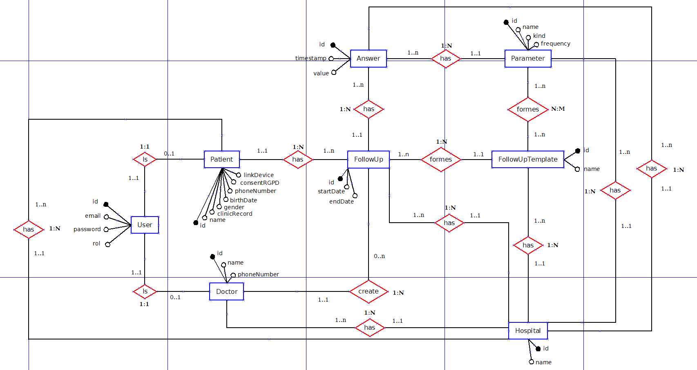
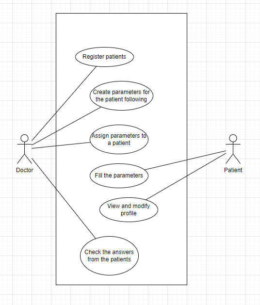

 

  <h3 align="center">Application for goal tracking for cardiology patients</h3>
  

    
    
    
  

   

# Documentation so far
We currently have two documents: an *ER Diagram* and a *Use Case*.

###
The *ER Diagram* has been done with an App called <a href="http://dia-installer.de/index.html.es">Dia</a>. 
You need to have the app installed in order to open the file "ER_Usabi.dia". 

###
The *Use Case Diagram* was done using <a href="https://app.diagrams.net/">Draw.io</a>. 
Just enter their page, select "Open Existing Diagran" and select the file "CasosDeUsoUsabi.drawio". 

